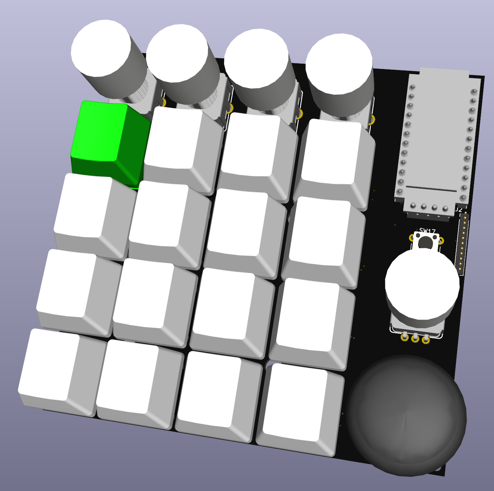

# fpad KiCAD data

## Features

- Key switch (Cherry MX compatible) x16
- Rotary Encoder - Illuminated (RGB) x5
- JoyStick x1

## License

- MIT License

## Files

- fpad7.kicad_pcb: main board
- fpad_bottom.kicad_pcb: bottom plate
- fpad_top.kicad_pcb: top plate

## Versions

- latest (recommended)
  - in root directory
- rev1 (deprecated)
  - in [releases/rev1](releases/rev1)

## Issues

- [rev1/errata.md](releases/rev1/errata.md)

## External files

### 3D CONTENTCENTRAL

The following 3D models are obtained from [3D CONTENTCENTRAL](https://www.3dcontentcentral.com/).
They are not included in this repository due to license, so please obtain them on your own and place them in the following paths.

- [Keycap](https://www.3dcontentcentral.com/secure/download-model.aspx?catalogid=171&id=941483)
  - external/3dcontentcentral/Mx_Keycap.step
- [JoyStick](https://www.3dcontentcentral.com/secure/download-model.aspx?catalogid=171&id=1681961)
  - external/3dcontentcentral/User Library-RKJXV122400R.step
- [RotaryEncoder](https://www.3dcontentcentral.com/download-model.aspx?catalogid=171&id=630216)
  - external/3dcontentcentral/User Library-Rotary Encoder v21.STEP

### SnapEDA

SnapEDA files are provided under this license as described in the following [FAQ - SnapEDA](https://www.snapeda.com/about/FAQ/).

### kbd, SparkFun-KiCAD-Libraries

Comply with the original license
